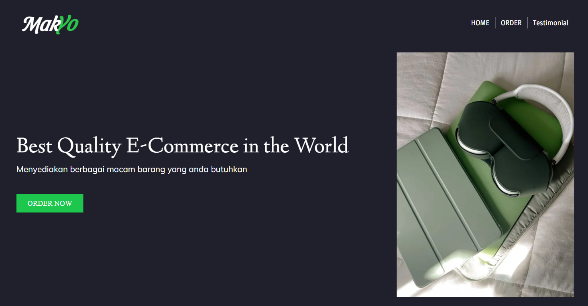

# MakYo



I'm Reynaldo Marchell Bagas adji from BINUS University, here's the final product for the study case Front End Developer Intern.

> I had tried to implement react query in this project. The app seems to be running perfectly, but a moment later, I've got several problem in Product component regarding the server and client component props like this one: "only plain objects, and a few built-ins, can be passed to server actions. classes or null prototypes are not supported."

> And so, I just go with traditional Axios get method instead. I've push the react query version to dev branch for further exploration.

### Tools that used in this app

- Next JS
- TypeScript
- Tailwind CSS (+Responsive)
- Axios and/or React Query
- Lucide React

## Installation

1. Clone this repository

```bash
  git clone https://github.com/reynaldomarchell/MakYo.git
```

2.  Go to the project directory and open VS Code

```bash
  cd MakYo
  code .
```

3. Open new terminal, install the dependencies and run the project

```bash
  npm i
  npm run dev
```

4. App will run on http://localhost:3000
